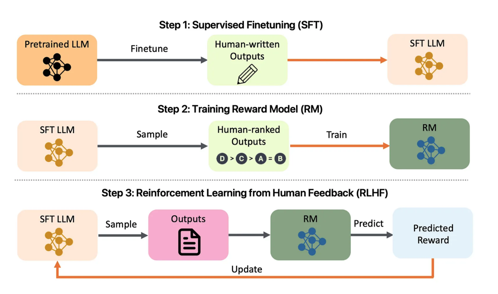

# 🌌 LLM Alignment Template - Your Template for Aligning Language Models

[](https://github.com/astorfi/LLM-Alignment-Project-Template/actions)
[](https://opensource.org/licenses/MIT)
[](https://github.com/astorfi/LLM-Alignment-Project-Template/issues)
[](https://www.python.org/)

## 📌 Introduction

# LLM Alignment Project

<p align="center">
  
  <br>
  <i>Figure 1: Overview of the LLM Alignment Project. Take a look at: <a href="https://arxiv.org/abs/2308.05374" target="_blank">arXiv:2308.05374</a></i>
</p>


**LLM Alignment Template** is not just a comprehensive tool for aligning large language models (LLMs), but also serves as a **powerful template** for building your own LLM alignment application. Inspired by project templates like **PyTorch Project Template**, this repository is designed to provide a full stack of functionality, acting as a starting point to customize and extend for your own LLM alignment needs. Whether you are a researcher, developer, or data scientist, this template provides a solid foundation for efficiently creating and deploying LLMs tailored to align with human values and objectives.

## 🚀 Overview

**LLM Alignment Template** provides a full stack of functionality, including training, fine-tuning, deploying, and monitoring LLMs using Reinforcement Learning from Human Feedback (RLHF). This project also integrates evaluation metrics to ensure ethical and effective use of language models. The interface offers a user-friendly experience for managing alignment, visualizing training metrics, and deploying at scale.

## ✨ Features

- **🌐 Interactive Web Interface**: A user-friendly interface for interacting with the LLM, training models, and viewing alignment metrics.
- **🧠 Training with RLHF**: Reinforcement Learning from Human Feedback to ensure model alignment with human preferences.
- **🛠️ Data Augmentation & Preprocessing**: Advanced preprocessing, tokenization, and data augmentation with back-translation and paraphrasing.
- **🔄 Transfer Learning**: Utilize pre-trained models like BERT for improved performance on specific tasks.
- **📦 Scalable Deployment**: Docker and Kubernetes-based deployment with Horizontal Pod Autoscaling (HPA).
- **🔍 Model Explainability**: SHAP-based dashboards for understanding model decisions.
- **📊 User Feedback Loop**: Collection of user ratings for fine-tuning models continuously.

## 📂 Table of Contents

- [Introduction](#-introduction)
- [Overview](#-overview)
- [Features](#-features)
- [Project Structure](#-project-structure)
- [Setup](#️-setup)
  - [Prerequisites](#prerequisites)
  - [Installation](#installation)
  - [Running Locally](#running-locally)
- [Deployment](#-deployment)
  - [Kubernetes Deployment](#kubernetes-deployment)
  - [Canary Deployment](#canary-deployment)
  - [Monitoring and Logging](#monitoring-and-logging)
- [Training and Evaluation](#-training-and-evaluation)
- [Testing](#-testing)
- [Future Work](#-future-work)
- [Contributing](#-contributing)
- [License](#-license)
- [Contact](#-contact)

## 📂 Project Structure

- **`app/`**: Contains API and UI code.
  - `auth.py`, `feedback.py`, `ui.py`: API endpoints for user interaction, feedback collection, and general interface management.
  - **Static Files**: JavaScript (`app.js`, `chart.js`), CSS (`styles.css`), and Swagger API documentation (`swagger.json`).
  - **Templates**: HTML templates (`chat.html`, `feedback.html`, `index.html`) for UI rendering.

- **`src/`**: Core logic and utilities for preprocessing and training.
  - **Preprocessing** (`preprocessing/`):
    - `preprocess_data.py`: Combines original and augmented datasets and applies text cleaning.
    - `tokenization.py`: Handles tokenization.
  - **Training** (`training/`):
    - `fine_tuning.py`, `transfer_learning.py`, `retrain_model.py`: Scripts for training and retraining models.
    - `rlhf.py`, `reward_model.py`: Scripts for reward model training using RLHF.
  - **Utilities** (`utils/`): Common utilities (`config.py`, `logging.py`, `validation.py`).

- **`dashboards/`**: Performance and explainability dashboards for monitoring and model insights.
  - `performance_dashboard.py`: Displays training metrics, validation loss, and accuracy.
  - `explainability_dashboard.py`: Visualizes SHAP values to provide insight into model decisions.

- **`tests/`**: Unit, integration, and end-to-end tests.
  - `test_api.py`, `test_preprocessing.py`, `test_training.py`: Various unit and integration tests.
  - **End-to-End Tests** (`e2e/`): Cypress-based UI tests (`ui_tests.spec.js`).
  - **Load Testing** (`load_testing/`): Uses Locust (`locustfile.py`) for load testing.

- **`deployment/`**: Configuration files for deployment and monitoring.
  - **Kubernetes Configurations** (`kubernetes/`): Deployment and Ingress configurations for scaling and canary releases.
  - **Monitoring** (`monitoring/`): Prometheus (`prometheus.yml`) and Grafana (`grafana_dashboard.json`) for performance and system health monitoring.

## ⚙️ Setup

### Prerequisites

- 🐍 Python 3.8+
- 🐳 Docker & Docker Compose
- ☸️ Kubernetes (Minikube or a cloud provider)
- 🟢 Node.js (for front-end dependencies)

### 📦 Installation

1. **Clone the Repository**:
   ```bash
   git clone https://github.com/yourusername/LLM-Alignment-Template.git
   cd LLM-Alignment-Template
   ```

2. **Install Dependencies**:
   - Python dependencies:
     ```bash
     pip install -r requirements.txt
     ```
   - Node.js dependencies (optional for UI improvements):
     ```bash
     cd app/static
     npm install
     ```

### 🏃 Running Locally

1. **Build Docker Images**:
   ```bash
   docker-compose up --build
   ```

2. **Access the Application**:
   - Open a browser and visit `http://localhost:5000`.

## 🚢 Deployment

### ☸️ Kubernetes Deployment

- **Deploy to Kubernetes**:
  - Apply the deployment and service configurations:
    ```bash
    kubectl apply -f deployment/kubernetes/deployment.yml
    kubectl apply -f deployment/kubernetes/service.yml
    ```
  - **Horizontal Pod Autoscaler**:
    ```bash
    kubectl apply -f deployment/kubernetes/hpa.yml
    ```

### 🌟 Canary Deployment

- Canary deployments are configured using `deployment/kubernetes/canary_deployment.yml` to roll out new versions safely.

### 📈 Monitoring and Logging

- **Prometheus and Grafana**:
  - Apply Prometheus and Grafana configurations in `deployment/monitoring/` to enable monitoring dashboards.
- **📋 Centralized Logging**: The **ELK Stack** is configured with Docker using `docker-compose.logging.yml` for centralized logs.

## 🧠 Training and Evaluation

### 🔄 Transfer Learning

The training module (`src/training/transfer_learning.py`) uses pre-trained models like **BERT** to adapt to custom tasks, providing a significant performance boost.

### 📊 Data Augmentation

The `data_augmentation.py` script (`src/data/`) applies augmentation techniques like back-translation and paraphrasing to improve data quality.

### 🧠 Reinforcement Learning from Human Feedback (RLHF)

- **Reward Model Training**: Uses the `rlhf.py` and `reward_model.py` scripts to fine-tune models based on human feedback.
- **Feedback Collection**: Users rate responses via the feedback form (`feedback.html`), and the model retrains with `retrain_model.py`.

### 🔍 Explainability Dashboard

The `explainability_dashboard.py` script uses **SHAP** values to help users understand why a model made specific predictions.

## 🧪 Testing

- **✅ Unit Tests**: Located in `tests/`, covering API, preprocessing, and training functionalities.
- **🖥️ End-to-End Tests**: Uses **Cypress** to test UI interactions.
- **📊 Load Testing**: Implemented with **Locust** (`tests/load_testing/locustfile.py`) to ensure stability under load.

## 🔮 Future Work

- **🔑 User Roles and Permissions**: Adding a role-based access control system.
- **📉 Advanced Monitoring**: Further enhance Prometheus alerts for anomaly detection.
- **🚀 Public Demo Deployment**: Deploy a public version on Heroku or AWS for showcasing.

## 🤝 Contributing

Contributions are welcome! Please submit pull requests or issues for improvements or new features.

## 📜 License

This project is licensed under the MIT License. See the [LICENSE](LICENSE) file for more information.

## 📬 Contact

- **📧 Email**: [amirsina.torfi@gmail.com](mailto:amirsina.torfi@gmail.com)
- **🌐 Website**: [Author Website](https://astorfi.github.io)

---

<p align="center">Developed with ❤️ by Amirsina Torfi</p>
